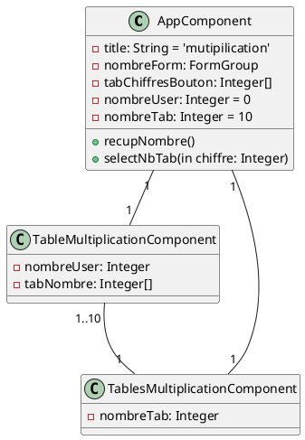

# Multiplication

**BERTRAND Julien**

[Enoncé du TP](https://slam-vinci-melun.github.io/sio22/phase2/TP-3.2-Angular-Multiplication.pdf)  
[Mon travail sur github](https://github.com/GlobeTique77/multiplication-angular/)

## Première partie

Tout d'abord on crée le projet avec la commande:
```
  ng new multiplication --style=css --routing=false
```

Comme c'est une application mono-page, pas besoin de routing et comme il y a du css, on le met comme paramètre de style.  
Ensuite on installe bulma en ligne de commande et on le rajoute dans le fichier angular.json .  
```
 npm install bulma --save
```
angular.json
```json
"styles": [
 "node_modules/bulma/css/bulma.min.css", //cette ligne
 "src/styles.css"
```

Ensuite on doit créer un nouveau composant. Pour ce faire, on utilise cette commande:
```
ng generate component components/TableMultiplication
```

Le but de la première partie est de demander à l'utilisateur d'entrer un nombre ce qui générera la table de multiplication de ce nombre.
En premier, on crée le formulaire dans le fichier app.component.html:
```html
        <form [formGroup]="nombreForm" (ngSubmit)="recupNombre()">
          <div class="field">
            <label class="label"></label>
            <div class="control">
              <input class="input is-success" formControlName="nombre" type="number" placeholder="Entrez un nombre"
                value="">
            </div>
          </div>
          <div class="field is-grouped">
            <div class="control">
              <button class="button is-link">Soumettre</button>
            </div>
          </div>
        </form>
```
On voit dans la balise form que ce formulaire est un objet de formGroup et comme nom nombreForm.  
Quand l'utilisateur clique sur le bouton "Soumettre", ça appel la méthode recupNombre() gràce à ngSubmit, cette méthode ce trouve dans app.component.ts .  
Le input a comme paramètre formControlName="nombre", il permet de bien récupérer la valeur que l'utilisateur lui met et le mettre dans l'objet formControl nombre de nombreForm.  
On met aussi le type number et un texte dans le placeholder pour préciser à l'utilisateur d'entrer un nombre.  

Regardons maintenant le code de app.component.ts
```ts
import { Component, Output, EventEmitter, OnInit } from '@angular/core';
import { FormControl, FormGroup } from '@angular/forms';

@Component({
  selector: 'app-root',
  templateUrl: './app.component.html',
  styleUrls: ['./app.component.css']
})
export class AppComponent {
  title = 'multiplication';

  nombreForm = new FormGroup({
    nombre: new FormControl()
  });

  tabChiffresBouton: number[] = [1, 2, 3, 4, 5, 6, 7, 8, 9, 10];
  nombreUser: number = 0;
  nombreTab: number = 10;

  recupNombre() {
    this.nombreUser = this.nombreForm.value.nombre;
  }


  selectNbTab(chiffre: number) {
    this.nombreTab = chiffre;
  }
}
```
On importe les classe FormControl et FormGroup pour le formulaire.  
Dans la partie export, on crée l'objet pour le formulaire qui s'appelle nombreForm et qui a un attribut nombre qui est un objet FormControl.  
C'est nombre qui aura la valeur donné par l'utilisateur.  
tabChiffresBouton est un tableau de nombre qui servira pour la seconde partie tout comme nombreTab.  
On instancie la variable nombreUser à 0.  
Ensuite on a la méthode recupNombre qui est appelée quand l'utilisateur clique sur le bouton Soumettre.  
Cette méthode assigne à nombreUser la valeur de nombre du formulaire nombreForm.  
L'autre méthode est aussi pour la seconde partie.  

Maintenant, on doit passer la variable nombreUser à table-multiplication.component.ts.  
On commence par appeler le component dans app.component.html après le formulaire avec :
```html
<app-table-multiplication></app-table-multiplication>
```
Puis on rajoute dans la balise, entre crochets la variable de table-multiplication.ts qui recevra la variable ou la valeur après le = , ici nombreUser 
pour la variable du component enfant (table-multiplication.component.ts) et aussi nombreUser pour la variable du component parent (app.component.ts).
```html
<app-table-multiplication [nombreUser]="nombreUser"></app-table-multiplication>
```

Voici le code de table.multiplication.component.ts:
```ts
import { Component, Input, OnInit } from '@angular/core';

@Component({
  selector: 'app-table-multiplication',
  templateUrl: './table-multiplication.component.html',
  styleUrls: ['./table-multiplication.component.css']
})
export class TableMultiplicationComponent implements OnInit {

  @Input() nombreUser!: number;

  tabNombres: number[] = [1, 2, 3, 4, 5, 6, 7, 8, 9, 10];


  constructor() { }

  ngOnInit(): void {
  }

}
```
On import Input et OnInit (même si on utilise pas ngOnInit, c'était automatique).  
Pour récupérer la variable nombreUser transmis par le parent, on utilise @Input().  
On crée aussi un tableau de nombres tabNombres qui servira dans le html.  
Justement, voici le code de table-multiplication.component.html:
```html
<table>
    <tr><th>Table de {{nombreUser}}</th></tr>
    <tr *ngFor="let nombre of tabNombres"> {{nombreUser}} x {{nombre}} = {{nombreUser * nombre}} </tr>
</table>
```
On crée un tableau, le premier tr indique que c'est la table de multiplication du nombre dans nombreUser en utilisant les doubles accolades et 
la variable qui est dans l'export du ts.  
Le deuxième tr a un *ngFor qui dit que pour chaque nombre du tableau tabNombres qui contient les nombres de 1 à 10, on affiche le nombre 
donné par l'utilisateur, le nombre du tableau tabNombres et leur multiplication.
Ce tableau s'affichera donc avec le code app.component.html comme on appelle composant table-multiplication.
  
Voici ce que ça donne une fois le serveur lancé (table de 0 car nombreUser a pour valeur par défaut 0):


Et quand on met un nombre (ex: 5):


Il y a un peu de css avec bulma et de ma part (margin: auto pour les tableaux et aussi les bordures)
  
## Deuxième partie

Le but de la deuxième partie et d'afficher un certain nombre de table de multiplication que veut l'utilisateur.
Comme la maquette du TP montrait les 10 premières tables, j'ai réutilisé les boutons à nombres qui servait pour le code du TD login.
Voilà le code dans app.component.html après l'appel du composant table-multiplication:
```html
        <div class="group">
          <p>Nombre de tables de multiplication à afficher:</p>
          <table id="chiffres">
            <td>
              <input *ngFor="let chiffre of tabChiffresBouton" id='{{chiffre}}' type='button' class='chiffre'
                (click)='selectNbTab(chiffre)' value='{{chiffre}}' />
            </td>
          </table>
        </div>
```
On crée un tableau qui contient dans une cellule des input boutons crées pour chaque nombre du tableau tabChiffresBonton de app.component.ts (de 1 à 10) avec un ngFor.  
Et quand on clique dessus, on appelle la méthode selectNbTab() avec comme paramètre la valeur du bouton.
Cette méthode qui se trouve dans app.component.ts met juste le paramètre chiffre dans nombreTab (voir première partie pour le code).  

Maintenant on crée un autre composant: tables-mutliplication
```
ng generate component components/TablesMultiplication
```
A la suite des boutons dans app.component.html, on appelle le composent:
```html
<app-tables-multiplication [nombreTab]="nombreTab"></app-tables-multiplication>
```
On tranfère à ce composant la variable nombreTab et elle le retrouvera dans sa variable nombreTab comme le montre le code de tables-multiplication.component.ts 
avec @Input()nombreTab!: number; :
```ts
import { Component, Input, OnInit } from '@angular/core';

@Component({
  selector: 'app-tables-multiplication',
  templateUrl: './tables-multiplication.component.html',
  styleUrls: ['./tables-multiplication.component.css']
})
export class TablesMultiplicationComponent implements OnInit {

  @Input() nombreTab!: number;

  constructor() { }

  ngOnInit(): void {
  }

}
```
Cette variable est utilisé dans son html:
```html
<table>
    <tr>
        <td *ngFor="let e of [].constructor(nombreTab); let i = index">
            <table>
                <app-table-multiplication [nombreUser]="i + 1"></app-table-multiplication>
                
            </table>
        </td>
    </tr>
</table>
```
Dans un tableau, on met sur une seul ligne nos tables de multiplications.  
Avec le ngFor dans le td, on crée un tableau de taille du nombre de table demandé par l'utilisateur (avec nombreTab).  
Ça fait un td pour à chaque valeur de ce tableau.  
Puis on crée un autre tableau et on appelle l'autre composant table-multiplication en lui donnant à la place de nombreUser donné par l'utilisateur avec app.component, 
i + 1 car le tableau costruit avec constructor allait de l'index 0 à 9, on veut de 1 à 10 dans + 1.
table-multiplication va donc produire un certain nombre de tableau et va les envoyer dans le html de tables-multiplication qui va les envoyer dans le html de app.component.

Voilà cette fois le code entier de app.component.html:
```html
<section class="section">
  <div class="container">
    <div class="columns is-centered">
      <div class="column is-half">
        <form [formGroup]="nombreForm" (ngSubmit)="recupNombre()">
          <div class="field">
            <label class="label"></label>
            <div class="control">
              <input class="input is-success" formControlName="nombre" type="number" placeholder="Entrez un nombre"
                value="">
            </div>
          </div>
          <div class="field is-grouped">
            <div class="control">
              <button class="button is-link">Soumettre</button>
            </div>
          </div>
        </form>
        <br>
        <app-table-multiplication [nombreUser]="nombreUser"></app-table-multiplication>
        <br>
        <div class="group">
          <p>Nombre de tables de multiplication à afficher:</p>
          <table id="chiffres">
            <tr id="ligne"></tr>
            <td>
              <input *ngFor="let chiffre of tabChiffresBouton" id='{{chiffre}}' type='button' class='chiffre'
                (click)='selectNbTab(chiffre)' value='{{chiffre}}' />
            </td>
          </table>
        </div>
      </div>
    </div>
    <app-tables-multiplication [nombreTab]="nombreTab"></app-tables-multiplication>
  </div>
</section>
```
Et les css
app.component.css (code repris du TD login avec quelques ajouts):
```css
table {
    margin: auto;
}

input, button {
	margin: center ;
}

p {
	text-align: center;
}


.chiffre {
	-moz-appearance: none;
	-webkit-appearance: none;
	-ms-appearance: none;
	appearance: none;
	-moz-transition: background-color 0.2s ease-in-out, color 0.2s ease-in-out;
	-webkit-transition: background-color 0.2s ease-in-out, color 0.2s ease-in-out;
	-ms-transition: background-color 0.2s ease-in-out, color 0.2s ease-in-out;
	transition: background-color 0.2s ease-in-out, color 0.2s ease-in-out;
	border-radius: 0.375em;
	border: 0;
	box-shadow: inset 0 0 0 2px blue;
	/* #f56a6a */
	color: blue !important;
	/* #f56a6a */
	cursor: pointer;
	display: inline-block;
	font-size: 0.8em;
	font-weight: 700;
	height: 3em;
	letter-spacing: 0.075em;
	line-height: 3em;
	padding: 0 1em;
	text-align: center;
	text-decoration: none;
	text-transform: uppercase;
	white-space: nowrap;
}

.chiffre:hover {
	background-color: rgba(245, 106, 106, 0.05);
}

.chiffre:active {
	background-color: rgba(245, 106, 106, 0.15);
}

.chiffre.icon:before {
	margin-right: 0.5em;
}

.chiffre.fit {
	width: 100%;
}

.chiffre.small {
	font-size: 0.6em;
}

.chiffre.large {
	font-size: 1em;
	height: 3.65em;
	line-height: 3.65em;
}

.chiffre.primary {
	background-color: blue;
	/* #f56a6a */
	box-shadow: none;
	color: #ffffff !important;
}

.chiffre.primary:hover {
	background-color: blue;
	/* #f67878 */
}

.chiffre.primary:active {
	background-color: blue;
	/* #f45c5c */
}

.chiffre.disabled,
.chiffre:disabled {
	pointer-events: none;
	opacity: 0.25;
}
```
table-multiplication.component.css
```css
table
{
    border-collapse: collapse;
    margin: auto;
    padding: 1em;
    border: 1px solid black;
}
td
{
    border: 1px solid black;
}


th{
    border: 1px solid black;
}
```
tables-multiplication.component.css
```css
table {
    margin: auto;
}
```
Ce qui donne lors du chargement de la page 10 tables car la valeur par défaut de nombreTab est 10 : 

Et si on sélectionne 4:


## Diagramme UML

Pour le diagramme UML on a 3 classes:
- AppComponent
- TableMultiplicationComponent
- TablesMultiplicationComponent  
Leurs relations sont des associations avec des liens bidirectionnels.  
Je donnerais leurs attributs et méthode plus bas (dans le diagramme)

### Relation AppComponent et TableMultiplicationComponent

Ces deux classes ont une relation d'association bidirectionnelle, AppComponent demande à TableMultiplicationComponent son html et TableMultiplicationComponent 
demande la variable nombreUser à AppComponent gràce à :
```html
        <app-table-multiplication [nombreUser]="nombreUser"></app-table-multiplication>
```
```ts
  @Input() nombreUser!: number;
```
Et cela une seule fois donc une  multiplicité de 1.

### Relation AppComponent et TablesMultiplicationComponent

Ces deux classes ont une relation d'association bidirectionnelle, AppComponent demande à TablesMultiplicationComponent son html et TablesMultiplicationComponent 
demande la variable nombreTab à AppComponent gràce à :
```html
    <app-tables-multiplication [nombreTab]="nombreTab"></app-tables-multiplication>
```
```ts
    @Input() nombreTab!: number;
```
Et cela une seule fois donc une  multiplicité de 1.

### Relation TableMultiplicationComponent et TablesMultiplicationComponent

Ces deux classes ont une relation d'association bidirectionnelle, TablesMultiplicationComponent demande à TableMultiplicationComponent son html et TableMultiplicationComponent 
demande la variable nombreUser à TablesMultiplicationComponent gràce à :
```html
    <app-table-multiplication [nombreUser]="i + 1"></app-table-multiplication>
```
```ts
      @Input() nombreUser!: number;
```
Et cela n fois car c'est un ngFor qui génère l'appel au composant nombreTab fois de 1 à 10 donc une  multiplicité de 1..10

### Le diagrame et le code 

Le diagrame:


Le code



